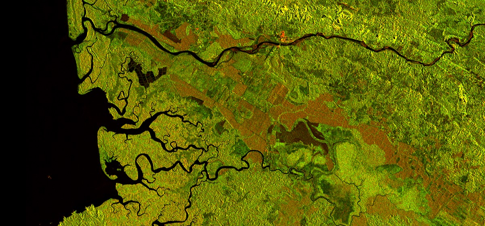

# Yana Nikolova
##                                  Specialized in Satellite Remote Sensing for Environmental Monitoring and Protection

I was born in Sofia, Bulgaria. I graduated a BS.c. in Conservation Biology and Management in [UK](https://www.stir.ac.uk/about/contact-us/) and I am curruntly specializing in GIS and Satellite Remote Sensing in [Austria](https://www.plus.ac.at/?lang=en).

